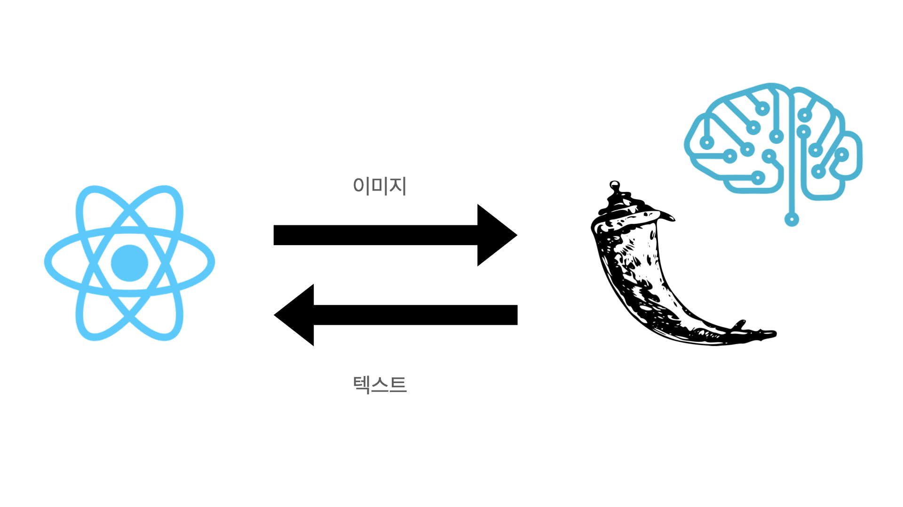
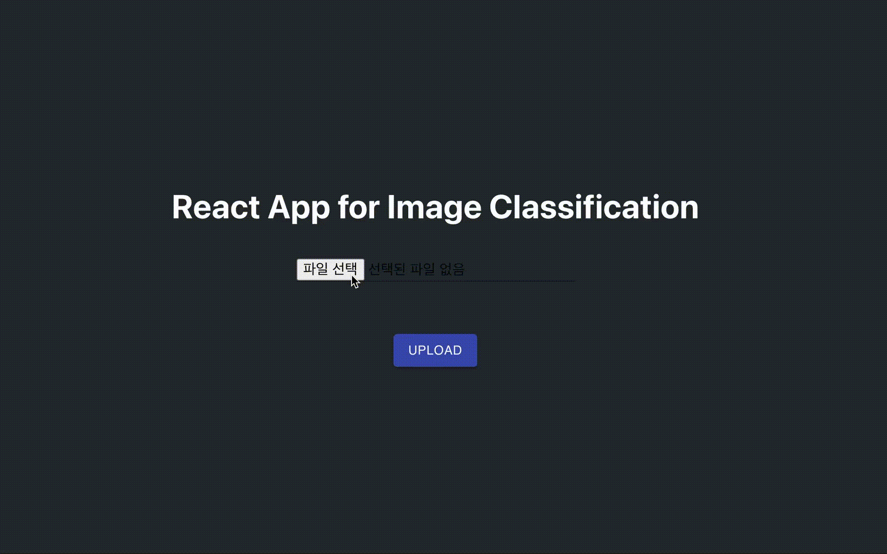

<h1 align="center">React App for Image Classification 👋</h1>


> React와 Flask간의 Post 통신과 TorchVision을 사용한 간단한 모델 테스트



## Install

```sh
npm i

or

yarn
```

## Usage for React

```sh
npm start

or

yarn start
```

## Usage for Flask
```sh
flask run # in api
```

## Requirements

```sh
pip -r install requirements.txt
```

## Demo Video


